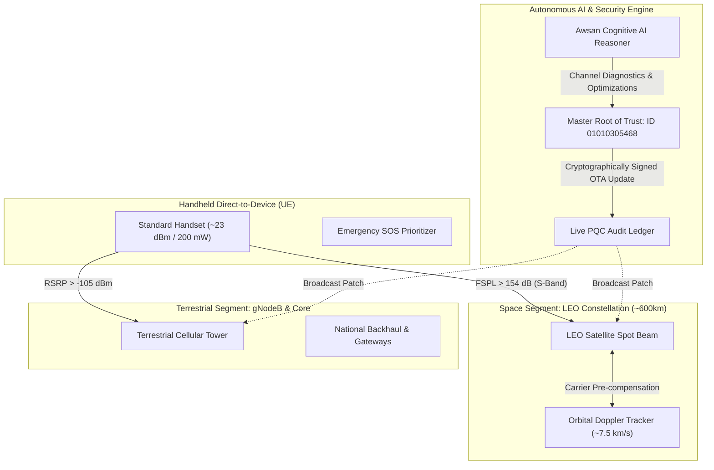

<!-- =========================================================================
   INTELLECTUAL PROPERTY & COPYRIGHT NOTICE
   =========================================================================
   Project Name: Awsan Communication Global Hub (6G Advanced Security & NTN Edition)
   Description : تحليل وتطبيق شبكات الجيل السادس غير الأرضية (إصدار تجريبي مكتمل)
   Author/Owner: Eng. Awsan Adel Abdulbari Ahmed Sultan
   Location    : Yemen
   National ID : 01010305468
   Contact Tel : +967 777852433
   
   Copyright (c) 2026 Eng. Awsan Adel Sultan. All Rights Reserved.
   ========================================================================= -->

# Awsan Communication Global Hub (6G Advanced Security & NTN Edition)

---

<p align="center">
  
</p>

---

**Chief Systems Engineer:** Eng. Awsan Adel Abdulbari Ahmed Sultan  
**National ID:** 01010305468 | **Country:** YEMEN | **Contact:** +967 777852433  
**Certification:** Expert-Level Network Configuration, 6G Architecture & NTN Space-Ground Integration  
**Edition:** Complete Experimental Edition (إصدار تجريبي مكتمل)

---

## 🛰️ 1. Executive Summary & 6G NTN Architecture

**Awsan Communication Global Hub** implements a unified **Space-Air-Ground Integrated Network (SAGIN)** topology. Rather than treating satellite communications as an isolated vertical solution, this project integrates low Earth orbit (LEO) satellites as an extended **Radio Access Network (RAN)** layer connected seamlessly to a 6G Service-Based Core.

The architecture addresses direct satellite-to-smartphone connectivity (**Direct-to-Device - D2D**), allowing standard user devices (UE) to establish links with orbiting satellites when terrestrial cellular towers are out of reach or disrupted by natural disasters.

---

    
---

## 🔬 2. Four Core NTN Physical & Engineering Challenges

Based on the physical and standard considerations of 6G NTN, the project incorporates computational models resolving the four primary direct-to-cell bottlenecks:

1. **User Equipment (UE) Hardware Constraints:** Standard smartphones utilize low-power transmitters (~23 dBm / 200 mW) and omnidirectional antennas (0 dBi). The system models link margins to compensate for body loss, indoor penetration loss, and foliage attenuation.
2. **Radio Channel Physics & Free-Space Path Loss (FSPL):** Overcoming slant distances ranging from 500 km to over 1200 km through dynamic link budget optimization.
3. **High LEO Orbital Dynamics & Rapid Doppler Shift:** LEO satellites orbit at velocities of ~7.5 km/s, inducing severe Doppler frequency shifts ($\approx \pm 40\text{ kHz}$ at 2 GHz). The Doppler engine pre-compensates for frequency offsets and jitter.
4. **Predictive Handover & Traffic Orchestration:** Multi-connectivity handovers between moving satellite spot beams and terrestrial base stations (gNodeB) driven by AI decision engines.

---

## 🌐 3. Tech Stack, Security & Protocols

### 🛰️ 6G Non-Terrestrial Network Modules (`core-ntn/`)
* **Link Budget Calculator (`link_budget.js`):** Computes FSPL, antenna gains (Tx/Rx), atmospheric loss, and thermal noise ($kTB$) to guarantee link viability.
* **Doppler Compensation Engine (`doppler_engine.js`):** Simulates LEO orbital velocities, Doppler shifts in Hz and PPM, and carrier frequency pre-compensation.
* **Handover Orchestrator (`handoff_orchestrator.js`):** Evaluates device RSRP, satellite elevation angles, and QoS priority (Emergency SOS vs. Data stream) to steer traffic.

### 🔒 Advanced Security & Zero-Trust Infrastructure
* **Post-Quantum Cryptography (PQC):** Hardened against quantum cryptanalysis threats.
* **DNS-over-TLS (DoT) & DoH:** Ultra-fast encrypted domain name resolution.
* **AI-Driven Threat Detection & DDoS Shield:** Real-time edge filtering compliant with RFC 8482.

### ⚡ Next-Gen Transport, IP & Network Slicing
* **Google Public DNS IPv4:** `8.8.8.8` | `8.8.4.4` (Sub-THz optimized).
* **Google Public DNS IPv6:** `2001:4860:4860::8888` | `2001:4860:4860::8844`.
* **Network Slicing:** Dedicated virtual slices for low-latency emergency messaging, sensor telemetry, and high-throughput data.
* **Connection Topology:** Permanent AI-optimized fiber/satellite hybrid mesh.

### 🔗 Domain & Backend Resolvers
* **Project Domain:** `awsandew.world.com`
* **Backend Resolver:** `dns.google` (`8.8.8.8`) configured under a Zero-Trust 6G framework.

---

## 📡 4. 6G NTN REST API Endpoints

The central application server (`server.js`) exposes real-time endpoints on port `8080`:

| Method | Endpoint | Function & Description |
| :--- | :--- | :--- |
| `GET` | `/` | Web Management Dashboard (Live Status, Nodes, Latency, and NTN Link Card). |
| `GET` | `/api/ntn/status` | Reports system health, active 3GPP Rel-18 capabilities, and orchestrator status. |
| `POST` | `/api/ntn/link-budget` | Computes physical link margin, FSPL, received power ($P_{rx}$), and SNR. |
| `POST` | `/api/ntn/doppler` | Calculates orbital velocity, Doppler shift (Hz / PPM), and compensated frequency. |
| `POST` | `/api/ntn/orchestrate` | Analyzes device telemetry to execute autonomous handovers between terrestrial and LEO layers. |

---


## 📁 5. Complete Repository Hierarchy & Detailed Dependency Tree

```text
Awsan-Communication-6G/
│
├── .github/                                # GitHub Configuration, Workflows & Sponsorship
│   ├── workflows/
│   │   └── ci.yml                          # Multi-Stack Automated Testing (Node.js & Python CI/CD)
│   └── FUNDING.yml                         # Official Repository Sponsorship Configuration
│
├── core-ntn/                               # 6G Non-Terrestrial Network Logic & Physics (JavaScript)
│   ├── link_budget.js                      # Link Budget, FSPL & Path Loss Mathematical Models
│   ├── doppler_engine.js                   # Orbital Velocity (~7.5 km/s) & Doppler Pre-compensation
│   └── handoff_orchestrator.js             # Predictive Multi-RAT Handover & Routing Engine
│
├── docs/                                   # Architectural Whitepapers & Standardization Docs
│   ├── architecture.md                     # 3D Space-Air-Ground Integrated Network (SAGIN)
│   └── 3gpp-specifications.md              # 3GPP Rel-17/18/19 & 6G Standards Roadmap
│
├── protocol/                               # Unified 6G NTN Global Protocol Suite & AI Engine (Python)
│   ├── __init__.py                         # Protocol Package API Exposure Initializer
│   └── awsan_6g_unified_protocol.py        # All-in-One Binary Protocol, AI-Driven OTA & Root of Trust
│   └── awsan_core_engine.py                # Core Subsystems Engine (Sections 5.1 to 10 Execution)
│   └── awsan_6g_applications.py            # 6G Next-Gen Applications & IMT-2030 Use-Cases Engine
│
├── tests/                                  # Automated Verification & Unit Test Suite
│   └── ntn_models.test.js                  # Physical Channel Models Verification (Node.js)
│
├── node_modules/                           # Deployed Runtime & Express Ecosystem (65 Packages)
│   ├── accepts/                            # HTTP Accept-* Header Parser
│   ├── body-parser/                        # Request Body Parsing Middleware
│   ├── bytes/                              # Byte String Conversion Utilities
│   ├── call-bind-apply-helpers/            # JS Function Bind & Apply Helpers
│   ├── call-bound/                         # Robust Prototype Call Binders
│   ├── content-disposition/                # Content-Disposition Header Parser
│   ├── content-type/                       # Content-Type Header Formatter
│   ├── cookie/                             # HTTP Cookie Serializer & Parser
│   ├── cookie-signature/                   # Cookie Cryptographic Signer
│   ├── debug/                              # Small Debugging Utility
│   ├── depd/                               # Deprecation Warning Utility
│   ├── dunder-proto/                       # __proto__ Object Access Helper
│   ├── ee-first/                           # Event Emitter First Listener
│   ├── encodeurl/                          # URL Encoder Utility
│   ├── es-define-property/                 # Object.defineProperty Wrapper
│   ├── es-errors/                          # Standard ECMAScript Error Generators
│   ├── es-object-atoms/                    # Fundamental ES Object References
│   ├── escape-html/                        # HTML Escaper for XSS Defense
│   ├── etag/                               # HTTP ETag Generator
│   ├── express/                            # Central HTTP & API Routing Framework
│   ├── finalhandler/                       # Out-of-middleware Response Responder
│   ├── forwarded/                          # Client Address Forwarding Parser
│   ├── fresh/                              # HTTP Cache Freshness Testing
│   ├── function-bind/                      # Standard Function.prototype.bind
│   ├── get-intrinsic/                      # Robust Core JS Intrinsics Resolver
│   ├── get-proto/                          # Object Prototype Retriever
│   ├── gopd/                               # Object Property Descriptor Getter
│   ├── has-symbols/                        # JavaScript Symbol Support Detector
│   ├── hasown/                             # Object.prototype.hasOwnProperty Helper
│   ├── http-errors/                        # HTTP Standard Error Constructor
│   ├── iconv-lite/                         # Character Encoding & Conversion
│   ├── inherits/                           # Prototype Inheritance Utility
│   ├── ipaddr.js/                          # IPv4 and IPv6 Manipulation Engine
│   ├── is-promise/                         # ES6 Promise Type Checking
│   ├── math-intrinsics/                    # Math Built-in Operations Helper
│   ├── media-typer/                        # MIME Media Type Analyzer
│   ├── merge-descriptors/                  # Object Descriptor Merger
│   ├── mime-db/                            # Comprehensive MIME Type Database
│   ├── mime-types/                         # Content-Type and Extension Mappings
│   ├── ms/                                 # Millisecond Parsing & Formatting
│   ├── negotiator/                         # HTTP Content Negotiation Library
│   ├── object-inspect/                     # String Representation of Objects
│   ├── on-finished/                        # HTTP Request Completion Listener
│   ├── once/                               # Single-execution Function Wrapper
│   ├── parseurl/                           # Fast URL Memoized Parser
│   ├── path-to-regexp/                     # Express Path to Regular Expression Compiler
│   ├── proxy-addr/                         # Proxy-aware Remote IP Filter
│   ├── qs/                                 # Query String Parser with Nesting Support
│   ├── range-parser/                       # HTTP Range Header Parser
│   ├── raw-body/                           # Stream-to-Buffer Body Reader
│   ├── router/                             # Express Core Routing Engine
│   ├── safer-buffer/                       # Safe Polyfill for Buffer Allocations
│   ├── send/                               # Static File Streaming Engine
│   ├── serve-static/                       # Static File Serving Middleware
│   ├── setprototypeof/                     # Object.setPrototypeOf Polyfill
│   ├── side-channel/                       # Safe Side-channel Storage Provider
│   ├── side-channel-list/                  # List Implementation for Side-channels
│   ├── side-channel-map/                   # Map Implementation for Side-channels
│   ├── side-channel-weakmap/               # WeakMap Implementation for Side-channels
│   ├── statuses/                           # HTTP Status Code Lookup Table
│   ├── toidentifier/                       # String to JS Identifier Sanitizer
│   ├── type-is/                            # Request Content-Type Validator
│   ├── unpipe/                             # Stream Unpiping Engine
│   ├── vary/                               # HTTP Vary Header Manipulator
│   ├── wrappy/                             # Function Wrapper Callback Utility
│   └── .package-lock.json                  # Local Dependencies Lock State
│
├── AWSAN COMMUNICATION 6G.png               # Official 6G Architectural Emblem & Shield Logo
├── CITATION.cff                            # Academic, IEEE & Institutional Citation Metadata
├── RFC-AWSAN-6G-NTN.md                     # Proposed Global Open Standard Specification (RFC Track)
├── README.md                               # Master Project Documentation & Mermaid Architecture
├── License                                 # Software Licensing & Terms of Use
├── .gitignore                              # Git Exclusions Configuration
│
├── server.js                               # Master Application Server & NTN REST API Gateway
├── index.js                                # Application Entry Point
├── advanced-dns-config.md                  # Advanced DNS-over-TLS (DoT) & DoH Specifications
├── auto_sync.sh                            # Automated Background Synchronization Script
├── sync.sh                                 # Manual Git Synchronization Script
├── package.json                            # Project Metadata, Scripts & Dependency Manifest
├── package-lock.json                       # Deterministic Dependency Version Tree
└── nohup.out                               # Background Execution Runtime Output

```


---

---

## 🚀 6G Enabled Applications & Next-Gen Use Cases

The **Awsan-6G-NTN** architecture natively supports the six transformative pillars defined under the **ITU-T IMT-2030** vision for 6G networks:

| Application Domain | Key 6G Capabilities | Latency Target | Reliability & Bandwidth | Primary Use Cases |
| :--- | :--- | :---: | :---: | :--- |
| **1. Extended Reality (XR) & Holographic Telepresence** | Cinema-grade photorealistic immersion, 6DoF interaction, zero-motion-sickness streaming. | $< 1\text{ ms}$ | $> 100\text{ Gbps}$ / $99.999\%$ | Remote holographic meetings, virtual immersive education, tactile internet surgery. |
| **2. Native / In-Network Artificial Intelligence** | AI embedded into the radio interface and RAN fabric; automated closed-loop self-optimization. | Real-Time | Distributed Edge Compute | Autonomous radio resource management, dynamic beam scheduling, predictive self-healing. |
| **3. Real-Time Digital Twins** | Continuous bidirectional state synchronization between physical assets and real-time virtual models. | $< 5\text{ ms}$ | High-Throughput Stream | Smart cities, automated container terminals, aerospace telemetry, predictive industrial maintenance. |
| **4. Autonomous Mobility & Swarm Robotics** | Deterministic cooperative perception and distributed multi-agent swarm coordination. | $< 1\text{ ms}$ | $99.99999\%$ (Ultra-Reliable) | Connected Autonomous Vehicles (V2X), automated delivery drones, cooperative industrial robots. |
| **5. Space-Air-Ground 3D Networks** | Seamless vertical coverage integrating LEO satellites, HAPS, drones, and terrestrial cells. | Flexible | 100% Ubiquitous Terrestrial & Space | Universal connectivity for rugged mountainous areas, desert logistics corridors, maritime routes. |
| **6. Integrated Sensing and Communication (ISAC)** | Joint radar-telecom wave utilization; the radio network acts as an environmental sensor. | Sub-ms | Centimeter-level accuracy | Remote vital-sign tracking, environmental hazard detection, ground and orbital space situational awareness. |


---
<!-- =========================================================================
   إشعار الملكية الفكرية وحقوق النشر البرمجية
   =========================================================================
   اسم المشروع  : مركز أوسان العالمي للاتصالات (Awsan Communication Global Hub)
   إصدار النظام : إصدار الأمان المتقدم وشبكات الجيل السادس غير الأرضية (6G NTN)
   الوصف        : تحليل وتطبيق شبكات الجيل السادس غير الأرضية (إصدار تجريبي مكتمل)
   المطور والمالك: م. أوسان عادل عبدالباري أحمد سلطان
   الدولة       : الجمهورية اليمنية
   الرقم القومي : 01010305468
   الهاتف       : 967777852433+
   
   جميع الحقوق محفوظة (c) 2026 م. أوسان عادل سلطان.
   ========================================================================= -->

# مركز أوسان العالمي للاتصالات (إصدار الأمان المتقدم وشبكات 6G NTN)
# Awsan Communication Global Hub (6G Advanced Security & NTN Edition)

---

<p align="center">
  
</p>

---

**كبير مهندسي النظم:** م. أوسان عادل عبدالباري أحمد سلطان  
**الرقم القومي:** 01010305468 | **الدولة:** الجمهورية اليمنية | **الهاتف:** 967777852433+  
**الاعتماد المهني:** خبير تهيئة الشبكات المتقدمة، معمارية الجيل السادس (6G)، وتكامل الفضاء والأرض (NTN)  
**نوع الإصدار:** إصدار تجريبي مكتمل (Complete Experimental Edition)

---

## 🛰️ 1. الملخص التنفيذي ومعمارية شبكات 6G NTN

يطبق مشروع **مركز أوسان العالمي للاتصالات** نموذج الشبكات المتكاملة بين الفضاء والأرض والجو (**SAGIN - Space-Air-Ground Integrated Network**). فبدلاً من التعامل مع الاتصالات الفضائية كنظام معزول، يتم دمج أقمار مدار الأرض المنخفض (**LEO Satellites**) كطبقة نفاذ راديوي ممتدة (**RAN**) متصلة مباشرة بنواة شبكة 6G الموحدة.

تتيح هذه المعمارية الاتصال المباشر من القمر الصناعي إلى الهاتف الذكي العادي (**Direct-to-Device - D2D**)، مما يتيح للهواتف والأجهزة الذكية الاتصال بالأقمار الصناعية تلقائياً عند انعدام التغطية الأرضية أو تعطل الأبراج الخلوية أثناء الكوارث الطبيعية.

---


---
## 🔬 2. التحديات الفيزيائية والهندسية الأربعة للاتصال الفضائي المباشر

بناءً على الدراسات والمعايير المعتمدة في 3GPP، يعالج المشروع العقبات الأربع الرئيسية التي تواجه الاتصال المباشر بين الهاتف والقمر الصناعي عبر نماذج رياضية دقيقة:

1. **محدودية قدرة الهواتف الذكية (UE Constraints):** تمتلك الهواتف هوائيات متناحية صغيرة بقدرة إرسال منخفضة (~23 dBm / 200 mW). يقوم النظام بحساب هوامش الربط لتعويض الفقد الناتج عن حجب جسم المستخدم، العوائق البيئية، والمباني.
2. **فيزياء القناة الراديوية وفقدان المسار (FSPL):** التغلب على المسافات المائلة الهائلة (من 500 كم إلى أكثر من 1200 كم) عبر حسابات ديناميكية دقيقة لميزانية الرابط.
3. **السرعة الفائقة لأقمار LEO وتأثير دوبلر:** تتحرك أقمار LEO بسرعة تقارب 7.5 كم/ثانية، مما ينتج انزياح دوبلر ترددياً حاداً يصل إلى ($\approx \pm 40\text{ kHz}$) عند تردد 2 جيجاهرتز. يوفر محرك دوبلر تعويضاً ترددياً مسبقاً لتثبيت الاتصال.
4. **التسليم التنبؤي والتوجيه الذكي (Predictive Handover):** إدارة عمليات الانتقال السلس للحزم بين الأبراج الأرضية والأقمار الصناعية المتحركة بالاعتماد على خوارزميات الذكاء الاصطناعي دون انقطاع الخدمة.

---

## 🌐 3. حزمة التقنيات والبروتوكولات ونواة الأمان

### 🛰️ محركات شبكات 6G غير الأرضية (`core-ntn/`)
* **محاسب ميزانية الرابط (`link_budget.js`):** حساب فقدان المسار في الفضاء الحر (FSPL)، كسب الهوائيات، الفقد الجوي، والضوضاء الحرارية ($kTB$) وفق مواصفات 3GPP NTN.
* **محرك تعويض انزياح دوبلر (`doppler_engine.js`):** محاكاة السرعة المدارية لأقمار LEO والانزياح الترددي بالهرتز وأجزاء المليون (PPM) وحساب التردد المعوض مسبقاً.
* **منسق التسليم والتوجيه التنبؤي (`handoff_orchestrator.js`):** اتخاذ القرار الآلي للمفاضلة بين الأبراج والأقمار بناءً على قوة الإشارة (RSRP) ونوع الخدمة (رسائل طوارئ SOS أو نقل بيانات).

### 🔒 الأمان المتقدم والتشفير ما بعد الكم
* **التشفير ما بعد الكم (Post-Quantum Cryptography - PQC):** حماية الشبكة ضد التهديدات المستقبلية للحواسيب الكمومية.
* **تشفير أسماء النطاقات (DoT و DoH):** تسريع وتأمين حركة حزم استعلامات DNS لشبكات 6G.
* **كشف التهديدات الذكي ودرع DDoS:** حماية فورية للعقد عند أطراف الشبكة متوافقة مع معيار RFC 8482.

### ⚡ البنية التحتية لعناوين IP وتقسيم الشبكة
* **خوادم Google DNS IPv4:** `8.8.8.8` | `8.8.4.4` (محسنة لترددات Sub-THz).
* **خوادم Google DNS IPv6:** `2001:4860:4860::8888` | `2001:4860:4860::8844`.
* **تقسيم الشبكة (Network Slicing):** تخصيص شرائح افتراضية لرسائل الطوارئ الحرجة، بيانات المستشعرات، والبيانات العامة.
* **طوبولوجيا الاتصال:** شبكة هجينة مستدامة تجمع بين الألياف الضوئية والأقمار الصناعية موجهة بالذكاء الاصطناعي.

### 🔗 النطاق والتكامل
* **نطاق المشروع:** `awsandew.world.com`
* **الموجه الخلفي:** `dns.google` (`8.8.8.8`) بنظام انعدام الثقة (Zero-Trust) لشبكات 6G.

---

## 📡 4. مسارات واجهات برمجة التطبيقات (6G NTN REST API)

يعمل خادم التطبيق الرئيسي (`server.js`) على المنفذ `8080` ويتيح المسارات الحية التالية:

| طريقة الطلب | المسار البرمجي (Endpoint) | الوظيفة والدور البرمجي |
| :--- | :--- | :--- |
| `GET` | `/` | لوحة التحكم الرسومية المباشرة (عرض الحالة، العقد، زمن الاستجابة، وبطاقة NTN). |
| `GET` | `/api/ntn/status` | تقرير الحالة الصحية للنظام وجاهزية معايير 3GPP Rel-18 النشطة. |
| `POST` | `/api/ntn/link-budget` | حساب ميزانية الرابط الفيزيائي، الفقد، وقدرة الاستقبال ونسبة SNR. |
| `POST` | `/api/ntn/doppler` | حساب السرعة المدارية وانزياح دوبلر والتردد المعوض مسبقاً. |
| `POST` | `/api/ntn/orchestrate` | تحليل إشارة الهاتف واتخاذ قرار التوجيه الفوري بين الأرض والفضاء. |

---## 📁 5. المخطط الهيكلي والشجري الشامل للمستودع وشجرة الاعتماديات المفصلة

```text
Awsan-Communication-6G/
│
├── .github/                                # إعدادات منصة GitHub والأتمتة وقنوات الرعاية الرسمية
│   ├── workflows/
│   │   └── ci.yml                          # أتمتة الفحص والتكامل المستمر المشترك (Node.js & Python CI/CD)
│   └── FUNDING.yml                         # ملف ضبط وتفعيل قنوات الرعاية والدعم الرسمي للمستودع
│
├── core-ntn/                               # النواة البرمجية لحسابات فيزياء 6G NTN (JavaScript)
│   ├── link_budget.js                      # معادلات ميزانية الرابط وفقدان المسار الراديوي
│   ├── doppler_engine.js                   # حساب السرعة المدارية (~7.5 كم/ث) وتعويض انزياح دوبلر
│   └── handoff_orchestrator.js             # محرك التوجيه والتسليم التنبؤي الذكي
│
├── docs/                                   # التوثيق المعماري والمعايير العالمية
│   ├── architecture.md                     # معمارية الشبكة الموحدة ثلاثية الأبعاد (SAGIN)
│   └── 3gpp-specifications.md              # مواءمة مواصفات 3GPP ومسار أبحاث الجيل السادس
│
├── protocol/                               # نواة البروتوكول المعياري ومحرك الذكاء الاصطناعي (Python)
│   ├── __init__.py                         # ملف تهيئة حزمة البروتوكول البرمجية
│   └── awsan_6g_unified_protocol.py        # المحرك الشامل للبروتوكول والتحديث الذاتي وجذر الثقة
│   └── awsan_core_engine.py                # المحرك التنفيذي للأنظمة الفرعية (الأقسام 5.1 إلى 10)
│   └── awsan_6g_applications.py            # محرك تطبيقات وخدمات الجيل السادس ورؤية IMT-2030
│
├── tests/                                  # جناح الاختبارات والتحقق الآلي
│   └── ntn_models.test.js                  # اختبارات فيزيائية ورياضية لنماذج القنوات الراديوية
│
├── node_modules/                           # حزم بيئة التشغيل وإطار عمل Express.js (65 مجلداً)
│   ├── accepts/                            # معالجة وتفسير ترويسات HTTP Accept
│   ├── body-parser/                        # وسيط قراءة وتحليل نصوص الطلبات البرمجية
│   ├── bytes/                              # دوال تحويل وقراءة أحجام وسعات البايت
│   ├── call-bind-apply-helpers/            # أدوات ربط وتنفيذ دوال JavaScript الجوهرية
│   ├── call-bound/                         # ربط استدعاءات النماذج الأصلية بدقة فائقة
│   ├── content-disposition/                # معالجة وتوجيه ترويسة Content-Disposition
│   ├── content-type/                       # تحديد وصياغة أنواع المحتوى الرقمي (MIME)
│   ├── cookie/                             # تشفير وقراءة وإدارة ملفات تعريف الارتباط
│   ├── cookie-signature/                   # التوقيع الرقمي المشفر لملفات الكوكيز
│   ├── debug/                              # وحدة تتبع ومعالجة الأخطاء البرمجية الخفيفة
│   ├── depd/                               # إدارة التنبيهات البرمجية للوظائف المهملة
│   ├── dunder-proto/                       # معالجة الوصول للكائنات عبر خاصية __proto__
│   ├── ee-first/                           # التقاط أول حدث صادر في Event Emitter
│   ├── encodeurl/                          # ترميز وتشفير الروابط وعناوين URL بأمان
│   ├── es-define-property/                 # معالجة وإسناد خصائص الكائنات في ECMAScript
│   ├── es-errors/                          # منشئ أخطاء ECMAScript القياسية
│   ├── es-object-atoms/                    # المراجع الأساسية لكائنات لغة JavaScript
│   ├── escape-html/                        # تنظيف نصوص HTML للحماية من هجمات XSS
│   ├── etag/                               # توليد رموز ETag للتحكم في التخزين المؤقت
│   ├── express/                            # إطار العمل الأساسي لبناء خوادم الويب وبوابات الـ API
│   ├── finalhandler/                       # معالجة الاستجابة النهائية خارج نطاق الوسطاء
│   ├── forwarded/                          # قراءة وفلترة عناوين IP المحولة عبر الوكلاء
│   ├── fresh/                              # فحص حداثة وصلاحية الذاكرة المؤقتة لـ HTTP
│   ├── function-bind/                      # الدالة القياسية لربط سياق الدوال البرمجية (bind)
│   ├── get-intrinsic/                      # جلب واستدعاء دوال JavaScript الجوهرية المدمجة
│   ├── get-proto/                          # استرجاع النماذج الأولية للكائنات البرمجية
│   ├── gopd/                               # استخراج واصفات خصائص الكائنات بدقة
│   ├── has-symbols/                        # التحقق من دعم بيئة التشغيل لرموز (Symbols)
│   ├── hasown/                             # دالة التحقق الآمنة من ملكية الخصائص للكائنات
│   ├── http-errors/                        # منشئ أخطاء HTTP المعيارية المنظمة
│   ├── iconv-lite/                         # تحويل وتشفير المحارف اللغوية والترميزات
│   ├── inherits/                           # دعم وتفعيل الوراثة البرمجية بين الكائنات
│   ├── ipaddr.js/                          # محرك إدارة ومعالجة وفحص عناوين IPv4 و IPv6
│   ├── is-promise/                         # التحقق من نوع وصحة الوعود البرمجية (Promises)
│   ├── math-intrinsics/                    # استدعاء العمليات الرياضية الجوهرية المدمجة
│   ├── media-typer/                        # تحليل وتحديد أنواع الوسائط والملفات الرقمية
│   ├── merge-descriptors/                  # دمج وتوحيد واصفات الكائنات البرمجية
│   ├── mime-db/                            # قاعدة بيانات شاملة ومعيارية لأنواع ملفات MIME
│   ├── mime-types/                         # مطابقة امتدادات الملفات مع أنواع المحتوى
│   ├── ms/                                 # تحويل التوقيت وأجزاء الثانية إلى نصوص مفهومة
│   ├── negotiator/                         # مكتبة التفاوض التلقائي على محتوى HTTP
│   ├── object-inspect/                     # الفحص البصري وطباعة محتويات الكائنات
│   ├── on-finished/                        # مراقبة اكتمال إرسال واستقبال طلبات HTTP
│   ├── once/                               # ضمان تنفيذ الدالة البرمجية لمرة واحدة فقط
│   ├── parseurl/                           # المحلل السريع والمخزن مؤقتاً لعناوين الروابط
│   ├── path-to-regexp/                     # تحويل مسارات خادم Express إلى تعبيرات نمطية
│   ├── proxy-addr/                         # تصفية وفحص عناوين IP القادمة عبر بروكسي
│   ├── qs/                                 # تحليل نصوص الاستعلامات المعقدة والمتشعبة
│   ├── range-parser/                       # تحليل أجزاء الملفات ونطاقات التحميل الجزئي
│   ├── raw-body/                           # قراءة البث المباشر للبيانات وتحويلها إلى Buffer
│   ├── router/                             # محرك توجيه الطلبات الداخلي لإطار Express
│   ├── safer-buffer/                       # تخصيص وإدارة الذاكرة المؤقتة بأمان تام
│   ├── send/                               # محرك بث وتدفق الملفات الثابتة عبر بروتوكول HTTP
│   ├── serve-static/                       # وسيط تقديم واستضافة الملفات والمواقع الثابتة
│   ├── setprototypeof/                     # إسناد وضبط النماذج الأولية للكائنات
│   ├── side-channel/                       # التخزين الجانبي الآمن لبيانات الكائنات البرمجية
│   ├── side-channel-list/                  # هيكل بيانات القوائم للتخزين الجانبي الآمن
│   ├── side-channel-map/                   # هيكل بيانات الخرائط للتخزين الجانبي الآمن
│   ├── side-channel-weakmap/               # هيكل بيانات WeakMap للتخزين الجانبي المؤقت
│   ├── statuses/                           # جدول ومصفوفة رموز حالات استجابة HTTP
│   ├── toidentifier/                       # تنظيف وتحويل النصوص إلى معرفات برمجية صالحة
│   ├── type-is/                            # التحقق الصارم من تطابق نوع محتوى الطلب
│   ├── unpipe/                             # فصل وإلغاء تدفق وتمرير البيانات بين القنوات
│   ├── vary/                               # إدارة وتعديل ترويسة HTTP Vary للتحكم بالتخزين
│   ├── wrappy/                             # أداة تغليف دوال الاستدعاء الرجعي (Callback)
│   └── .package-lock.json                  # ملف تثبيت الإصدارات المحلية للحزم بدقة
│
├── AWSAN COMMUNICATION 6G.png               # الشعار والدرع الرسمي المعتمد لمشروع اتصالات 6G
├── CITATION.cff                            # ملف التوثيق والاستشهاد الأكاديمي الدولي (IEEE / Research)
├── RFC-AWSAN-6G-NTN.md                     # وثيقة المعيار الدولي المفتوح المقترح (RFC Track)
├── README.md                               # ملف التوثيق الشامل والرسمي للمستودع ومخطط المعمارية
├── License                                 # ترخيص وشروط الاستخدام وحماية الملكية الفكرية
├── .gitignore                              # ملف استثناءات وفلاتر نظام Git
│
├── server.js                               # خادم التطبيق الرئيسي وبوابات الـ NTN REST API
├── index.js                                # نقطة الدخول البرمجية للمشروع
├── advanced-dns-config.md                  # توثيق إعدادات DNS المشفر فائق السرعة (DoT / DoH)
├── auto_sync.sh                            # سكربت المزامنة الآلية الخلفية لـ Git
├── sync.sh                                 # سكربت المزامنة اليدوية لـ Git
├── package.json                            # بيان المشروع والتبعيات والبيانات الوصفية
├── package-lock.json                       # شجرة تثبيت إصدارات الحزم والاعتماديات بدقة
└── nohup.out                               # مخرجات وسجلات التشغيل الخلفي للنظام
```


---

---

## 🚀 التطبيقات والخدمات المستقبلية المدعومة في شبكات 6G

تدعم معمارية **مركز أوسان لشبكات 6G NTN** الركائز الست الأساسية للجيل القادم وفق رؤية الاتحاد الدولي للاتصالات (**ITU-T IMT-2030**):

| مجال التطبيق | القدرات المعمارية للجيل السادس | زمن التأخير المستهدف | الموثوقية ومعدل نقل البيانات | حالات الاستخدام والتطبيق العملي |
| :--- | :--- | :---: | :---: | :--- |
| **1. الواقع الممتد (XR) والتواجد الهولوغرامي** | بيئات واقع افتراضي ومعزز فائقة الدقة (6DoF) وانعدام الدوار الحركي. | أقل من 1 مللي ثانية | أكثر من 100 جيجابت/ث | الاجتماعات الهولوغرامية، العمليات الجراحية عن بُعد، والتعليم التفاعلي. |
| **2. الذكاء الاصطناعي المدمج بالشبكة** | الذكاء الاصطناعي ليس تطبيقاً خارجياً بل جزء من نسيج واجهة الراديو وتوزيع الموارد. | في الوقت الحقيقي | حوسبة حافة موزعة | الإدارة الذاتية للطيف الترددي، توجيه الحزم الفضائية، والإصلاح الذاتي الآلي. |
| **3. التوأم الرقمي الحي (Digital Twins)** | مزامنة رقمية فورية ثنائية الاتجاه بين الأصول الفيزيائية ونظيراتها الافتراضية. | أقل من 5 مللي ثانية | تدفق بيانات متواصل | المدن الذكية، الموانئ المؤتمتة، محاكاة الأنظمة الصناعية وتوقع الأعطال. |
| **4. التنقل الذاتي وروبوتات الأسراب** | إدراك تعاوني للمركبات ذاتية القيادة وتنسيق جماعي دقيق لأسراب الدرونز والروبوتات. | أقل من 1 مللي ثانية | موثوقية 99.99999% | السيارات ذاتية القيادة (V2X)، طائرات التوصيل الذاتي، الروبوتات الصناعية. |
| **5. الشبكات ثلاثية الأبعاد (3D Networks)** | تغطية رأسية متكاملة تدمج أقمار LEO والمنصات الجوية (HAPS) والأبراج الأرضية. | مرن ومستدام | تغطية بنسبة 100% | ربط المناطق الجبلية الوعرة، ممرات التجارة البرية والبحرية، والصحاري. |
| **6. الاستشعار الراديوي والاتصال المدمج (ISAC)** | استخدام نفس الموجات اللاسلكية للرادار والاتصال معاً؛ الشبكة تعمل كمستشعر بيئي. | أجزاء من الملي ثانية | دقة سنتيمترية | المراقبة الصحية عن بُعد، رصد الكوارث الطبيعية، ومراقبة حركة الفضاء والأرض. |
---
