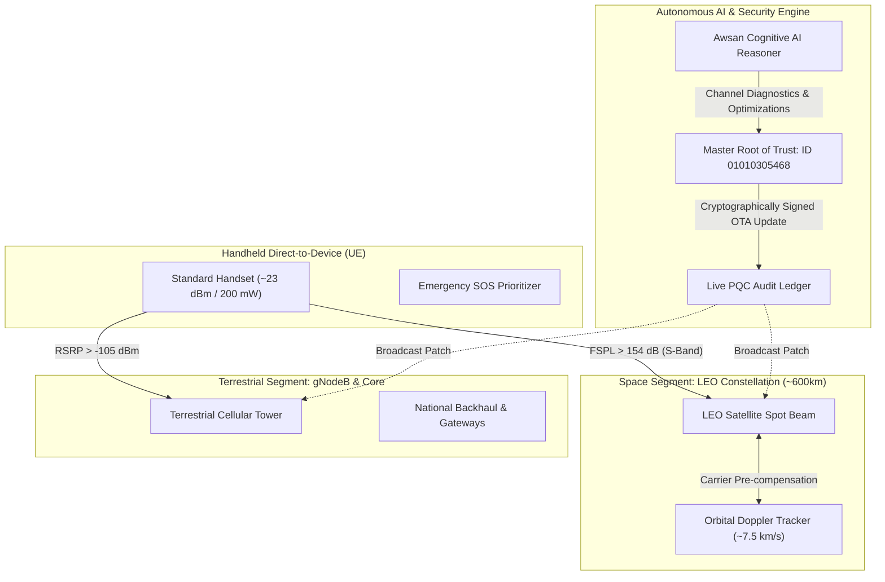

<!-- =========================================================================
   INTELLECTUAL PROPERTY & COPYRIGHT NOTICE
   =========================================================================
   Project Name: Awsan Communication Global Hub (6G Advanced Security & NTN Edition)
   Description : تحليل وتطبيق شبكات الجيل السادس غير الأرضية (إصدار تجريبي مكتمل)
   Author/Owner: Eng. Awsan Adel Abdulbari Ahmed Sultan
   Location    : Yemen
   National ID : 01010305468
   Contact Tel : +967 777852433
   
   Copyright (c) 2026 Eng. Awsan Adel Sultan. All Rights Reserved.
   ========================================================================= -->

# Awsan Communication Global Hub (6G Advanced Security & NTN Edition)

---

<p align="center">
  
</p>

---

**Chief Systems Engineer:** Eng. Awsan Adel Abdulbari Ahmed Sultan  
**National ID:** 01010305468 | **Country:** YEMEN | **Contact:** +967 777852433  
**Certification:** Expert-Level Network Configuration, 6G Architecture & NTN Space-Ground Integration  
**Edition:** Complete Experimental Edition (إصدار تجريبي مكتمل)

---

## 🛰️ 1. Executive Summary & 6G NTN Architecture

**Awsan Communication Global Hub** implements a unified **Space-Air-Ground Integrated Network (SAGIN)** topology. Rather than treating satellite communications as an isolated vertical solution, this project integrates low Earth orbit (LEO) satellites as an extended **Radio Access Network (RAN)** layer connected seamlessly to a 6G Service-Based Core.

The architecture addresses direct satellite-to-smartphone connectivity (**Direct-to-Device - D2D**), allowing standard user devices (UE) to establish links with orbiting satellites when terrestrial cellular towers are out of reach or disrupted by natural disasters.

---

    
---

## 🔬 2. Four Core NTN Physical & Engineering Challenges

Based on the physical and standard considerations of 6G NTN, the project incorporates computational models resolving the four primary direct-to-cell bottlenecks:

1. **User Equipment (UE) Hardware Constraints:** Standard smartphones utilize low-power transmitters (~23 dBm / 200 mW) and omnidirectional antennas (0 dBi). The system models link margins to compensate for body loss, indoor penetration loss, and foliage attenuation.
2. **Radio Channel Physics & Free-Space Path Loss (FSPL):** Overcoming slant distances ranging from 500 km to over 1200 km through dynamic link budget optimization.
3. **High LEO Orbital Dynamics & Rapid Doppler Shift:** LEO satellites orbit at velocities of ~7.5 km/s, inducing severe Doppler frequency shifts ($\approx \pm 40\text{ kHz}$ at 2 GHz). The Doppler engine pre-compensates for frequency offsets and jitter.
4. **Predictive Handover & Traffic Orchestration:** Multi-connectivity handovers between moving satellite spot beams and terrestrial base stations (gNodeB) driven by AI decision engines.

---

## 🌐 3. Tech Stack, Security & Protocols

### 🛰️ 6G Non-Terrestrial Network Modules (`core-ntn/`)
* **Link Budget Calculator (`link_budget.js`):** Computes FSPL, antenna gains (Tx/Rx), atmospheric loss, and thermal noise ($kTB$) to guarantee link viability.
* **Doppler Compensation Engine (`doppler_engine.js`):** Simulates LEO orbital velocities, Doppler shifts in Hz and PPM, and carrier frequency pre-compensation.
* **Handover Orchestrator (`handoff_orchestrator.js`):** Evaluates device RSRP, satellite elevation angles, and QoS priority (Emergency SOS vs. Data stream) to steer traffic.

### 🔒 Advanced Security & Zero-Trust Infrastructure
* **Post-Quantum Cryptography (PQC):** Hardened against quantum cryptanalysis threats.
* **DNS-over-TLS (DoT) & DoH:** Ultra-fast encrypted domain name resolution.
* **AI-Driven Threat Detection & DDoS Shield:** Real-time edge filtering compliant with RFC 8482.

### ⚡ Next-Gen Transport, IP & Network Slicing
* **Google Public DNS IPv4:** `8.8.8.8` | `8.8.4.4` (Sub-THz optimized).
* **Google Public DNS IPv6:** `2001:4860:4860::8888` | `2001:4860:4860::8844`.
* **Network Slicing:** Dedicated virtual slices for low-latency emergency messaging, sensor telemetry, and high-throughput data.
* **Connection Topology:** Permanent AI-optimized fiber/satellite hybrid mesh.

### 🔗 Domain & Backend Resolvers
* **Project Domain:** `awsandew.world.com`
* **Backend Resolver:** `dns.google` (`8.8.8.8`) configured under a Zero-Trust 6G framework.

---

## 📡 4. 6G NTN REST API Endpoints

The central application server (`server.js`) exposes real-time endpoints on port `8080`:

| Method | Endpoint | Function & Description |
| :--- | :--- | :--- |
| `GET` | `/` | Web Management Dashboard (Live Status, Nodes, Latency, and NTN Link Card). |
| `GET` | `/api/ntn/status` | Reports system health, active 3GPP Rel-18 capabilities, and orchestrator status. |
| `POST` | `/api/ntn/link-budget` | Computes physical link margin, FSPL, received power ($P_{rx}$), and SNR. |
| `POST` | `/api/ntn/doppler` | Calculates orbital velocity, Doppler shift (Hz / PPM), and compensated frequency. |
| `POST` | `/api/ntn/orchestrate` | Analyzes device telemetry to execute autonomous handovers between terrestrial and LEO layers. |

---

## 📁 5. Complete Repository Hierarchy & Detailed Dependency Tree

```text
Awsan-Communication-6G/
│
├── workflows/
│   └── ci.yml                              # Continuous Integration & Automated Tests
│
├── core-ntn/                               # 6G Non-Terrestrial Network Logic & Physics
│   ├── link_budget.js                      # Link Budget & Path Loss Equations
│   ├── doppler_engine.js                   # Orbital Velocity & Doppler Pre-compensation
│   └── handoff_orchestrator.js             # Predictive Handover & Steering Engine
│
├── docs/                                   # Standards & Architecture Documentation
│   ├── architecture.md                     # 3D SAGIN Unified Architecture
│   └── 3gpp-specifications.md              # 3GPP Rel-17/18 & 6G Standards Roadmap
│
├── tests/                                  # Automated Test Suite
│   └── ntn_models.test.js                  # Physical Verification & Model Tests
│
├── node_modules/                           # Deployed Runtime & Express Ecosystem
│   ├── accepts/                            # HTTP Accept-* Header Parser
│   ├── body-parser/                        # Request Body Parsing Middleware
│   ├── bytes/                              # Byte String Conversion Utilities
│   ├── call-bind-apply-helpers/            # JS Function Bind & Apply Helpers
│   ├── call-bound/                         # Robust Prototype Call Binders
│   ├── content-disposition/                # Content-Disposition Header Parser
│   ├── content-type/                       # Content-Type Header Formatter
│   ├── cookie/                             # HTTP Cookie Serializer & Parser
│   ├── cookie-signature/                   # Cookie Cryptographic Signer
│   ├── debug/                              # Small Debugging Utility
│   ├── depd/                               # Deprecation Warning Utility
│   ├── dunder-proto/                       # __proto__ Object Access Helper
│   ├── ee-first/                           # Event Emitter First Listener
│   ├── encodeurl/                          # URL Encoder Utility
│   ├── es-define-property/                 # Object.defineProperty Wrapper
│   ├── es-errors/                          # Standard ECMAScript Error Generators
│   ├── es-object-atoms/                    # Fundamental ES Object References
│   ├── escape-html/                        # HTML Escaper for XSS Defense
│   ├── etag/                               # HTTP ETag Generator
│   ├── express/                            # Central HTTP & API Routing Framework
│   ├── finalhandler/                       # Out-of-middleware Response Responder
│   ├── forwarded/                          # Client Address Forwarding Parser
│   ├── fresh/                              # HTTP Cache Freshness Testing
│   ├── function-bind/                      # Standard Function.prototype.bind
│   ├── get-intrinsic/                      # Robust Core JS Intrinsics Resolver
│   ├── get-proto/                          # Object Prototype Retriever
│   ├── gopd/                               # Object Property Descriptor Getter
│   ├── has-symbols/                        # JavaScript Symbol Support Detector
│   ├── hasown/                             # Object.prototype.hasOwnProperty Helper
│   ├── http-errors/                        # HTTP Standard Error Constructor
│   ├── iconv-lite/                         # Character Encoding & Conversion
│   ├── inherits/                           # Prototype Inheritance Utility
│   ├── ipaddr.js/                          # IPv4 and IPv6 Manipulation Engine
│   ├── is-promise/                         # ES6 Promise Type Checking
│   ├── math-intrinsics/                    # Math Built-in Operations Helper
│   ├── media-typer/                        # MIME Media Type Analyzer
│   ├── merge-descriptors/                  # Object Descriptor Merger
│   ├── mime-db/                            # Comprehensive MIME Type Database
│   ├── mime-types/                         # Content-Type and Extension Mappings
│   ├── ms/                                 # Millisecond Parsing & Formatting
│   ├── negotiator/                         # HTTP Content Negotiation Library
│   ├── object-inspect/                     # String Representation of Objects
│   ├── on-finished/                        # HTTP Request Completion Listener
│   ├── once/                               # Single-execution Function Wrapper
│   ├── parseurl/                           # Fast URL Memoized Parser
│   ├── path-to-regexp/                     # Express Path to Regular Expression Compiler
│   ├── proxy-addr/                         # Proxy-aware Remote IP Filter
│   ├── qs/                                 # Query String Parser with Nesting Support
│   ├── range-parser/                       # HTTP Range Header Parser
│   ├── raw-body/                           # Stream-to-Buffer Body Reader
│   ├── router/                             # Express Core Routing Engine
│   ├── safer-buffer/                       # Safe Polyfill for Buffer Allocations
│   ├── send/                               # Static File Streaming Engine
│   ├── serve-static/                       # Static File Serving Middleware
│   ├── setprototypeof/                     # Object.setPrototypeOf Polyfill
│   ├── side-channel/                       # Safe Side-channel Storage Provider
│   ├── side-channel-list/                  # List Implementation for Side-channels
│   ├── side-channel-map/                   # Map Implementation for Side-channels
│   ├── side-channel-weakmap/               # WeakMap Implementation for Side-channels
│   ├── statuses/                           # HTTP Status Code Lookup Table
│   ├── toidentifier/                       # String to JS Identifier Sanitizer
│   ├── type-is/                            # Request Content-Type Validator
│   ├── unpipe/                             # Stream Unpiping Engine
│   ├── vary/                               # HTTP Vary Header Manipulator
│   ├── wrappy/                             # Function Wrapper Callback Utility
│   └── .package-lock.json                  # Local Dependencies Lock State
│
├── server.js                               # Master Application Server & NTN REST API
├── index.js                                # Application Entry Point
├── advanced-dns-config.md                  # Advanced DNS-over-TLS & DoH Specifications
├── auto_sync.sh                            # Automated Background Synchronization Script
├── sync.sh                                 # Manual Git Synchronization Script
├── package.json                            # Project Metadata, Scripts & Dependency Manifest
├── package-lock.json                       # Deterministic Dependency Version Tree
├── License                                 # Software Licensing & Terms
├── .gitignore                              # Git Exclusions Configuration
├── nohup.out                               # Background Execution Runtime Output
└── README.md                               # Master Project Documentation

```


---

<!-- =========================================================================
   إشعار الملكية الفكرية وحقوق النشر البرمجية
   =========================================================================
   اسم المشروع  : مركز أوسان العالمي للاتصالات (Awsan Communication Global Hub)
   إصدار النظام : إصدار الأمان المتقدم وشبكات الجيل السادس غير الأرضية (6G NTN)
   الوصف        : تحليل وتطبيق شبكات الجيل السادس غير الأرضية (إصدار تجريبي مكتمل)
   المطور والمالك: م. أوسان عادل عبدالباري أحمد سلطان
   الدولة       : الجمهورية اليمنية
   الرقم القومي : 01010305468
   الهاتف       : 967777852433+
   
   جميع الحقوق محفوظة (c) 2026 م. أوسان عادل سلطان.
   ========================================================================= -->

# مركز أوسان العالمي للاتصالات (إصدار الأمان المتقدم وشبكات 6G NTN)
# Awsan Communication Global Hub (6G Advanced Security & NTN Edition)

---

<p align="center">
  
</p>

---

**كبير مهندسي النظم:** م. أوسان عادل عبدالباري أحمد سلطان  
**الرقم القومي:** 01010305468 | **الدولة:** الجمهورية اليمنية | **الهاتف:** 967777852433+  
**الاعتماد المهني:** خبير تهيئة الشبكات المتقدمة، معمارية الجيل السادس (6G)، وتكامل الفضاء والأرض (NTN)  
**نوع الإصدار:** إصدار تجريبي مكتمل (Complete Experimental Edition)

---

## 🛰️ 1. الملخص التنفيذي ومعمارية شبكات 6G NTN

يطبق مشروع **مركز أوسان العالمي للاتصالات** نموذج الشبكات المتكاملة بين الفضاء والأرض والجو (**SAGIN - Space-Air-Ground Integrated Network**). فبدلاً من التعامل مع الاتصالات الفضائية كنظام معزول، يتم دمج أقمار مدار الأرض المنخفض (**LEO Satellites**) كطبقة نفاذ راديوي ممتدة (**RAN**) متصلة مباشرة بنواة شبكة 6G الموحدة.

تتيح هذه المعمارية الاتصال المباشر من القمر الصناعي إلى الهاتف الذكي العادي (**Direct-to-Device - D2D**)، مما يتيح للهواتف والأجهزة الذكية الاتصال بالأقمار الصناعية تلقائياً عند انعدام التغطية الأرضية أو تعطل الأبراج الخلوية أثناء الكوارث الطبيعية.

---


---
## 🔬 2. التحديات الفيزيائية والهندسية الأربعة للاتصال الفضائي المباشر

بناءً على الدراسات والمعايير المعتمدة في 3GPP، يعالج المشروع العقبات الأربع الرئيسية التي تواجه الاتصال المباشر بين الهاتف والقمر الصناعي عبر نماذج رياضية دقيقة:

1. **محدودية قدرة الهواتف الذكية (UE Constraints):** تمتلك الهواتف هوائيات متناحية صغيرة بقدرة إرسال منخفضة (~23 dBm / 200 mW). يقوم النظام بحساب هوامش الربط لتعويض الفقد الناتج عن حجب جسم المستخدم، العوائق البيئية، والمباني.
2. **فيزياء القناة الراديوية وفقدان المسار (FSPL):** التغلب على المسافات المائلة الهائلة (من 500 كم إلى أكثر من 1200 كم) عبر حسابات ديناميكية دقيقة لميزانية الرابط.
3. **السرعة الفائقة لأقمار LEO وتأثير دوبلر:** تتحرك أقمار LEO بسرعة تقارب 7.5 كم/ثانية، مما ينتج انزياح دوبلر ترددياً حاداً يصل إلى ($\approx \pm 40\text{ kHz}$) عند تردد 2 جيجاهرتز. يوفر محرك دوبلر تعويضاً ترددياً مسبقاً لتثبيت الاتصال.
4. **التسليم التنبؤي والتوجيه الذكي (Predictive Handover):** إدارة عمليات الانتقال السلس للحزم بين الأبراج الأرضية والأقمار الصناعية المتحركة بالاعتماد على خوارزميات الذكاء الاصطناعي دون انقطاع الخدمة.

---

## 🌐 3. حزمة التقنيات والبروتوكولات ونواة الأمان

### 🛰️ محركات شبكات 6G غير الأرضية (`core-ntn/`)
* **محاسب ميزانية الرابط (`link_budget.js`):** حساب فقدان المسار في الفضاء الحر (FSPL)، كسب الهوائيات، الفقد الجوي، والضوضاء الحرارية ($kTB$) وفق مواصفات 3GPP NTN.
* **محرك تعويض انزياح دوبلر (`doppler_engine.js`):** محاكاة السرعة المدارية لأقمار LEO والانزياح الترددي بالهرتز وأجزاء المليون (PPM) وحساب التردد المعوض مسبقاً.
* **منسق التسليم والتوجيه التنبؤي (`handoff_orchestrator.js`):** اتخاذ القرار الآلي للمفاضلة بين الأبراج والأقمار بناءً على قوة الإشارة (RSRP) ونوع الخدمة (رسائل طوارئ SOS أو نقل بيانات).

### 🔒 الأمان المتقدم والتشفير ما بعد الكم
* **التشفير ما بعد الكم (Post-Quantum Cryptography - PQC):** حماية الشبكة ضد التهديدات المستقبلية للحواسيب الكمومية.
* **تشفير أسماء النطاقات (DoT و DoH):** تسريع وتأمين حركة حزم استعلامات DNS لشبكات 6G.
* **كشف التهديدات الذكي ودرع DDoS:** حماية فورية للعقد عند أطراف الشبكة متوافقة مع معيار RFC 8482.

### ⚡ البنية التحتية لعناوين IP وتقسيم الشبكة
* **خوادم Google DNS IPv4:** `8.8.8.8` | `8.8.4.4` (محسنة لترددات Sub-THz).
* **خوادم Google DNS IPv6:** `2001:4860:4860::8888` | `2001:4860:4860::8844`.
* **تقسيم الشبكة (Network Slicing):** تخصيص شرائح افتراضية لرسائل الطوارئ الحرجة، بيانات المستشعرات، والبيانات العامة.
* **طوبولوجيا الاتصال:** شبكة هجينة مستدامة تجمع بين الألياف الضوئية والأقمار الصناعية موجهة بالذكاء الاصطناعي.

### 🔗 النطاق والتكامل
* **نطاق المشروع:** `awsandew.world.com`
* **الموجه الخلفي:** `dns.google` (`8.8.8.8`) بنظام انعدام الثقة (Zero-Trust) لشبكات 6G.

---

## 📡 4. مسارات واجهات برمجة التطبيقات (6G NTN REST API)

يعمل خادم التطبيق الرئيسي (`server.js`) على المنفذ `8080` ويتيح المسارات الحية التالية:

| طريقة الطلب | المسار البرمجي (Endpoint) | الوظيفة والدور البرمجي |
| :--- | :--- | :--- |
| `GET` | `/` | لوحة التحكم الرسومية المباشرة (عرض الحالة، العقد، زمن الاستجابة، وبطاقة NTN). |
| `GET` | `/api/ntn/status` | تقرير الحالة الصحية للنظام وجاهزية معايير 3GPP Rel-18 النشطة. |
| `POST` | `/api/ntn/link-budget` | حساب ميزانية الرابط الفيزيائي، الفقد، وقدرة الاستقبال ونسبة SNR. |
| `POST` | `/api/ntn/doppler` | حساب السرعة المدارية وانزياح دوبلر والتردد المعوض مسبقاً. |
| `POST` | `/api/ntn/orchestrate` | تحليل إشارة الهاتف واتخاذ قرار التوجيه الفوري بين الأرض والفضاء. |

---

## 📁 5. المخطط الهيكلي والشجري المتكامل للمستودع

```text
Awsan-Communication-6G/
│
├── .github/                                # إعدادات منصة GitHub وأتمتة العمليات
│   └── workflows/
│       └── ci.yml                          # أتمتة الفحص والتكامل المستمر (CI/CD)
│
├── core-ntn/                               # النواة البرمجية لحسابات فيزياء 6G NTN
│   ├── link_budget.js                      # معادلات ميزانية الرابط وفقدان المسار الراديوي
│   ├── doppler_engine.js                   # حساب السرعة المدارية وتعويض انزياح دوبلر
│   └── handoff_orchestrator.js             # محرك التوجيه والتسليم التنبؤي الذكي
│
├── docs/                                   # التوثيق المعماري والمعايير العالمية
│   ├── architecture.md                     # معمارية الشبكة الموحدة ثلاثية الأبعاد (SAGIN)
│   └── 3gpp-specifications.md              # مواءمة مواصفات 3GPP Rel-17/18 ومسار 6G
│
├── tests/                                  # جناح الاختبارات والتحقق الآلي
│   └── ntn_models.test.js                  # اختبارات رياضية وفيزيائية للنماذج البرمجية
│
├── node_modules/                           # حزم بيئة التشغيل وإطار عمل Express.js (65 مجلداً)
│   ├── accepts/                            # معالجة ترويسات HTTP Accept
│   ├── body-parser/                        # وسيط قراءة وتحليل نصوص الطلبات البرمجية
│   ├── bytes/                              # دوال تحويل وقراءة أحجام البايت
│   ├── call-bind-apply-helpers/            # أدوات ربط وتنفيذ دوال JavaScript
│   ├── call-bound/                         # ربط استدعاءات النماذج الأصلية بدقة
│   ├── content-disposition/                # معالجة ترويسة Content-Disposition
│   ├── content-type/                       # تحديد وصياغة أنواع المحتوى (MIME)
│   ├── cookie/                             # تشفير وقراءة ملفات تعريف الارتباط
│   ├── cookie-signature/                   # التوقيع الرقمي لملفات الكوكيز
│   ├── debug/                              # وحدة تتبع الأخطاء البرمجية الخفيفة
│   ├── depd/                               # إدارة التنبيهات البرمجية للوظائف المهملة
│   ├── dunder-proto/                       # معالجة الوصول للكائنات عبر __proto__
│   ├── ee-first/                           # التقاط أول حدث في Event Emitter
│   ├── encodeurl/                          # ترميز وتشفير الروابط وعناوين URL
│   ├── es-define-property/                 # معالجة خصائص الكائنات في ECMAScript
│   ├── es-errors/                          # منشئ أخطاء ECMAScript القياسية
│   ├── es-object-atoms/                    # المراجع الأساسية لكائنات لغة JavaScript
│   ├── escape-html/                        # تنظيف نصوص HTML للحماية من هجمات XSS
│   ├── etag/                               # توليد رموز ETag للتخزين المؤقت
│   ├── express/                            # إطار العمل الأساسي لبناء خوادم الويب والـ API
│   ├── finalhandler/                       # معالجة الاستجابة النهائية خارج الوسطاء
│   ├── forwarded/                          # قراءة عناوين IP المحولة عبر الوكلاء
│   ├── fresh/                              # فحص حداثة وصلاحية الذاكرة المؤقتة لـ HTTP
│   ├── function-bind/                      # الدالة القياسية لربط سياق الدوال (bind)
│   ├── get-intrinsic/                      # جلب واستدعاء دوال JavaScript الجوهرية
│   ├── get-proto/                          # استرجاع النماذج الأولية للكائنات
│   ├── gopd/                               # استخراج واصفات خصائص الكائنات
│   ├── has-symbols/                        # التحقق من دعم محرك المتصفح للرموز (Symbols)
│   ├── hasown/                             # دالة التحقق الآمنة من ملكية الخصائص للكائنات
│   ├── http-errors/                        # منشئ أخطاء HTTP المعيارية
│   ├── iconv-lite/                         # تحويل وتشفير المحارف اللغوية
│   ├── inherits/                           # دعم الوراثة البرمجية بين الكائنات
│   ├── ipaddr.js/                          # محرك إدارة ومعالجة عناوين IPv4 و IPv6
│   ├── is-promise/                         # التحقق من نوع الوعود البرمجية (Promises)
│   ├── math-intrinsics/                    # استدعاء العمليات الرياضية الجوهرية المدمجة
│   ├── media-typer/                        # تحليل وتحديد أنواع الوسائط الرقمية
│   ├── merge-descriptors/                  # دمج واصفات الكائنات البرمجية
│   ├── mime-db/                            # قاعدة بيانات شاملة لأنواع ملفات MIME
│   ├── mime-types/                         # مطابقة الامتدادات مع أنواع المحتوى
│   ├── ms/                                 # تحويل التوقيت وأجزاء الثانية إلى نصوص
│   ├── negotiator/                         # مكتبة التفاوض على محتوى HTTP
│   ├── object-inspect/                     # الفحص البصري وطباعة الكائنات
│   ├── on-finished/                        # مراقبة اكتمال إرسال واستقبال طلبات HTTP
│   ├── once/                               # ضمان تنفيذ الدالة البرمجية مرة واحدة فقط
│   ├── parseurl/                           # المحلل السريع لعناوين الروابط المخزنة
│   ├── path-to-regexp/                     # تحويل مسارات Express إلى تعبيرات نمطية
│   ├── proxy-addr/                         # تصفية عناوين IP القادمة عبر بروكسي
│   ├── qs/                                 # تحليل نصوص الاستعلامات المعقدة والمتشعبة
│   ├── range-parser/                       # تحليل أجزاء الملفات ونطاقات التحميل
│   ├── raw-body/                           # قراءة البث المباشر للبيانات إلى Buffer
│   ├── router/                             # محرك توجيه الطلبات الداخلي لـ Express
│   ├── safer-buffer/                       # تخصيص الذاكرة المؤقتة بأمان تام
│   ├── send/                               # محرك بث وتدفق الملفات الثابتة عبر HTTP
│   ├── serve-static/                       # وسيط تقديم الملفات والمواقع الثابتة
│   ├── setprototypeof/                     # إسناد النماذج الأولية للكائنات
│   ├── side-channel/                       # التخزين الجانبي الآمن لبيانات الكائنات
│   ├── side-channel-list/                  # هيكل بيانات القوائم للتخزين الجانبي
│   ├── side-channel-map/                   # هيكل بيانات الخرائط للتخزين الجانبي
│   ├── side-channel-weakmap/               # هيكل بيانات WeakMap للتخزين المؤقت
│   ├── statuses/                           # جدول ومصفوفة رموز حالات استجابة HTTP
│   ├── toidentifier/                       # تنظيف وتحويل النصوص إلى معرفات برمجية
│   ├── type-is/                            # التحقق الصارم من نوع محتوى الطلب
│   ├── unpipe/                             # فصل وإلغاء تدفق البيانات بين القنوات
│   ├── vary/                               # إدارة وتعديل ترويسة HTTP Vary
│   ├── wrappy/                             # أداة تغليف دوال الاستدعاء الرجعي
│   └── .package-lock.json                  # ملف تثبيت الإصدارات المحلية للحزم
│
├── server.js                               # خادم التطبيق الرئيسي وواجهات الـ NTN API
├── index.js                                # نقطة الدخول البرمجية للمشروع
├── advanced-dns-config.md                  # توثيق إعدادات DNS المشفر (DoT / DoH)
├── auto_sync

```
